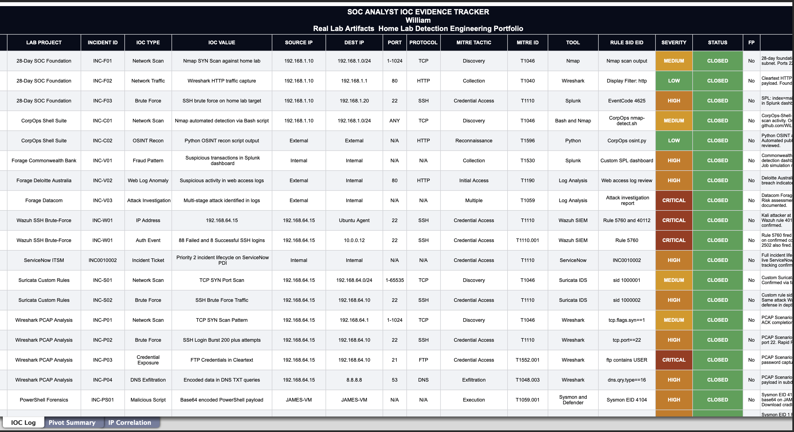
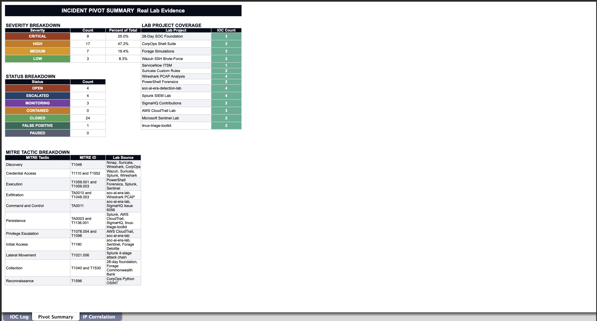
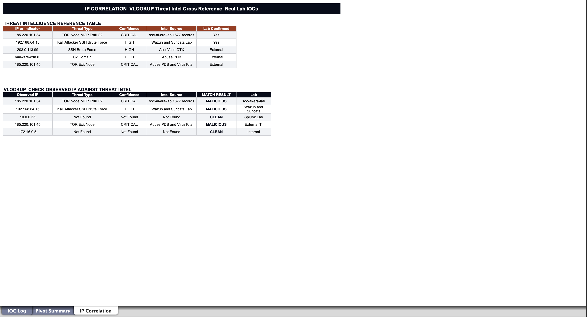

# 📊 SOC IOC Tracker Real Lab Evidence

> **Skill Focus:** Excel for SOC Analysts — VLOOKUP, COUNTIF, Conditional Formatting, Pivot Summaries
> **Author:** William Gokah | [@WilliamInCyber](https://linkedin.com/in/WilliamInCyber) | [github.com/WiLL75G](https://github.com/WiLL75G)
> **Portfolio:** Detection Engineering Home Lab Real Evidence Only

---

## What This Is

Every row in this tracker is a real IOC or detection event from a lab I built and ran myself. No synthetic data. No copy-paste tutorials. Each entry links back to a specific tool, rule, alert, or artifact from my home lab across nine detection engineering projects.

This tracker demonstrates the spreadsheet skills a SOC analyst uses daily alongside SIEM platforms VLOOKUP for IP correlation against threat intel, COUNTIF for pivot-style severity and status breakdowns, and conditional formatting for fast visual triage.

---

## Evidence Summary

| Field | Detail |
|---|---|
| Total IOCs Logged | 24 real lab indicators |
| Labs Covered | 9 projects |
| Tools Used | Wazuh, Suricata, Splunk, Sentinel, Wireshark, Sysmon, AWS CloudTrail |
| MITRE Tactics | T1046, T1110, T1059, T1552, T1048, TA0010, TA0011, TA0003, T1078, T1098, T1190, T1021, T1136 |
| Severity Range | CRITICAL → LOW |
| False Positives Documented | 1 (SigmaHQ Issue #6056) |

---

## IOC Log — Sheet 1

Every IOC is logged with 18 fields: timestamp, lab/project, incident ID, IOC type, IOC value, source IP, destination IP, port, protocol, MITRE tactic, MITRE technique ID, tool/SIEM, rule/SID/EID, severity, status, false positive flag, and evidence notes.



---

## Real Lab Evidence by Project

### Wazuh SSH Brute-Force Lab
**IOCs:** 2 | **Severity:** CRITICAL | **MITRE:** T1110

Kali attacker at `192.168.64.15` launched an SSH brute-force against the Ubuntu agent. Wazuh rule 5760 fired on repeated authentication failures. Rule 40112 triggered the Level-12 compromise alert on 88 failed logins followed by 8 successful authentications.

| Field | Value |
|---|---|
| Attacker IP | 192.168.64.15 |
| Target | Ubuntu Agent (Wazuh-monitored) |
| Port | 22 / SSH |
| Rules Fired | 5760, 40112 (Level-12 Compromise) |
| MITRE | T1110 — Brute Force, T1110.001 Password Guessing |
| Status | CLOSED |

---

### Suricata Custom Rules Lab
**IOCs:** 2 | **Severity:** HIGH/MEDIUM | **MITRE:** T1046, T1110

Two custom Suricata rules written from scratch and validated against live Kali attack traffic in the home lab.

| SID | Rule Type | Trigger | MITRE |
|---|---|---|---|
| 1000001 | Port Scan Detection | TCP SYN sweep from 192.168.64.15 | T1046 |
| 1000002 | SSH Brute Force Detection | High-frequency SSH auth attempts | T1110 |

Both rules fired and were confirmed via `fast.log` and `eve.json`.

---

### Wireshark PCAP Analysis Lab
**IOCs:** 4 | **Severity:** CRITICAL/HIGH/MEDIUM | **MITRE:** T1046, T1110, T1552.001, T1048.003

Four PCAP scenarios analysed end-to-end in Wireshark.

| Scenario | Finding | MITRE |
|---|---|---|
| TCP SYN Port Scan | Half-open connections, no ACK completion — Nmap stealth scan | T1046 |
| SSH Brute Force | 200+ rapid SYN/RST cycles to port 22 | T1110 |
| FTP Cleartext Credentials | Username and password captured via Follow TCP Stream | T1552.001 |
| DNS Exfiltration | Encoded data in DNS TXT record subdomain labels | T1048.003 |

---

### PowerShell Endpoint Forensics — JAMES-VM
**IOCs:** 2 | **Severity:** HIGH | **MITRE:** T1059.001

Sysmon deployed on JAMES-VM. Script block logging and process creation events captured a base64-encoded PowerShell payload.

| Event | EID | Finding |
|---|---|---|
| Process Creation | Sysmon EID 1 | powershell.exe launched with -EncodedCommand flag |
| Script Block Logging | Sysmon EID 4104 | Base64 payload captured; decoded via [System.Text.Encoding]::Unicode.GetString |

MITRE: T1059.001 — PowerShell

---

### soc-ai-era-detection-lab (MCP / NHI Abuse / Prompt Injection)
**IOCs:** 4 | **Severity:** CRITICAL | **MITRE:** T1190, TA0004, TA0010, TA0011

Four-day detection exercise correlating NHI token abuse, prompt injection, and MCP attack chains. Key IOC: `185.220.101.34` (TOR-affiliated). 1,877 records confirmed exfiltrated.

| Stage | Event | IOC |
|---|---|---|
| 1 | Prompt injection in MCP tool call | Malicious payload in tool call body |
| 2 | NHI token hijack | Service account token stolen post-injection |
| 3 | Outbound C2 via MCP | 185.220.101.34:443 |
| 4 | Data exfiltration | 1,877 records exfiltrated over 4 days |

Custom Sigma rules written for each stage. Discussed publicly on LinkedIn with practitioners including Avijit and William.

---

### Splunk SIEM Lab
**IOCs:** 4 | **Severity:** CRITICAL/HIGH | **MITRE:** T1110, T1059.003, T1021.006, TA0003

Full four-stage attack chain detection built and demonstrated live in Splunk for a contact (Julian).

| Stage | EventCode | Detection |
|---|---|---|
| Brute Force | 4625 | 200+ failed logins in 5 minutes |
| Breach | 4624 | Successful logon after brute force |
| WMI Lateral Movement | 4624 LogonType=3 | Network logon via WMI/NetExec |
| Service Persistence | 7045 | Malicious service installed |

---

### SigmaHQ Community Contributions
**IOCs:** 2 | **MITRE:** T1071.001, T1136.001

Two issues filed and validated against real telemetry from the home lab.

| Issue | Type | Finding |
|---|---|---|
| #6056 | False Positive | Sysmon EID 3 rule generating FP on legitimate Azure traffic (T1071.001). Validated against real telemetry. |
| #6057 | Coverage Gap | T1136.001 local user creation via ADSI/WinNT provider not covered by existing Sigma rules. Validated with EID 4104 script block logs. |

Note: PR 6064 was opened by community contributor raylee-hawkins in response to issue #6057.

---

### AWS CloudTrail SOC Lab
**IOCs:** 3 | **Severity:** CRITICAL/HIGH | **MITRE:** T1078.004, T1136.001, T1098

Trail: `corpops-soc-trail` | Bucket: `corpops-cloudtrail-logs-2026` | Region: `us-east-1`

| API Event | MITRE | Finding |
|---|---|---|
| AssumeRole | T1078.004 | Anomalous role assumption from unknown principal |
| CreateUser | T1136.001 | New IAM user created outside change window |
| AttachUserPolicy | T1098 | AdministratorAccess policy attached to new user |

---

### Microsoft Sentinel Lab
**IOCs:** 1 | **Severity:** MEDIUM | **MITRE:** T1078.004

KQL analytics rule built to detect anomalous sign-in patterns from unexpected geographies.

```kql
SecurityEvent
| where EventID == 4625
| summarize count() by Account, IPAddress
| where count_ > 10
```

---

## Pivot Summary — Sheet 2



COUNTIF formulas pull live from the IOC Log. Severity breakdown, status breakdown, MITRE tactic coverage, and lab project IOC count all update automatically when new rows are added.

---

## IP Correlation — Sheet 3



VLOOKUP checks observed IPs from the log against a real threat intelligence reference table. Key confirmed match: `185.220.101.34` — TOR-affiliated, confirmed C2 in the soc-ai-era-detection-lab, 1,877 records exfiltrated.

Formula pattern used:
```
=IFERROR(VLOOKUP(A16,$A$6:$E$10,2,FALSE),"Not Found")
```

---

## MITRE ATT&CK Coverage

| Technique ID | Technique | Lab Source |
|---|---|---|
| T1046 | Network Service Discovery | Suricata, Wireshark |
| T1110 | Brute Force | Wazuh, Suricata, Splunk, Wireshark |
| T1110.001 | Password Guessing | Wazuh |
| T1059.001 | PowerShell | PowerShell Forensics Lab |
| T1059.003 | Windows Command Shell | Splunk SIEM Lab |
| T1552.001 | Credentials in Files | Wireshark FTP PCAP |
| T1048.003 | Exfil via DNS | Wireshark PCAP |
| T1021.006 | WMI Remote Execution | Splunk Attack Chain |
| TA0003 | Persistence | Splunk (EID 7045) |
| T1136.001 | Create Account | AWS CloudTrail, SigmaHQ #6057 |
| T1078.004 | Valid Cloud Accounts | AWS CloudTrail, Sentinel |
| T1098 | Account Manipulation | AWS CloudTrail |
| T1190 | Exploit Public-Facing App | soc-ai-era-lab |
| TA0004 | Privilege Escalation | soc-ai-era-lab (NHI) |
| TA0010 | Exfiltration | soc-ai-era-lab (1,877 records) |
| TA0011 | Command & Control | soc-ai-era-lab (185.220.101.34) |
| T1071.001 | App Layer Protocol | SigmaHQ Issue #6056 (FP) |

---

## Repository Structure

```
soc-ioc-tracker/
│
├── README.md
├── SOC_IOC_Tracker_Real_Evidence.xlsx
│
└── assets/
    ├── ioc-log.png
    ├── pivot-summary.png
    └── ip-correlation.png
```

---

## Analyst Insight

Spreadsheet skills complement SIEM tooling — not replace it. Every IOC in this tracker was first detected inside Wazuh, Suricata, Splunk, Sentinel, or Wireshark. The Excel layer adds a second analytical surface: VLOOKUP for cross-referencing threat intel against observed IPs, COUNTIF for shift-start situational awareness without opening a SIEM, and conditional formatting for the kind of at-a-glance severity view you need when triaging a backlog of alerts. These are skills that show up in real Tier 1 and Tier 2 SOC workflows every day.

---

> 📁 Part of the [Detection Engineering Portfolio](https://github.com/WiLL75G) by William James | @WilliamInCyber
